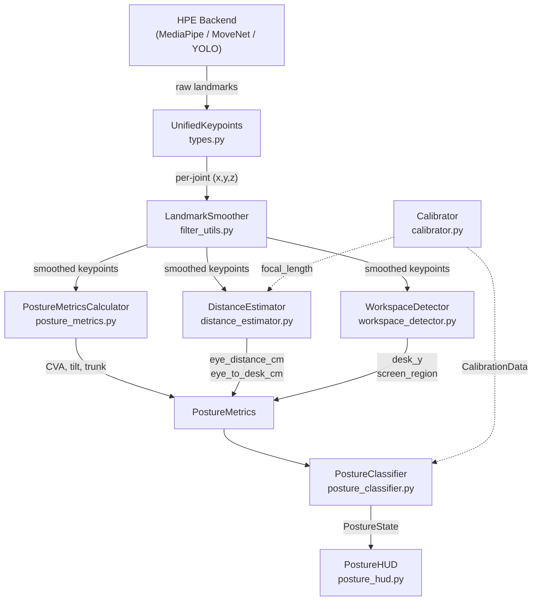

# Posture Analyzer — Technical Reference & Mathematical Formulas

> **Module**: `posture_analyzer/`  
> **Version**: v1.0 — SpineVision EdgeAI  
> **Last updated**: 2026-09-26

---

## Table of Contents

1. [Architecture Overview](#1-architecture-overview)
2. [Coordinate System Conventions](#2-coordinate-system-conventions)
3. [Landmark Smoothing (One-Euro Filter)](#3-landmark-smoothing-one-euro-filter)
4. [Posture Metrics — Mathematical Formulas](#4-posture-metrics--mathematical-formulas)
   - 4.1 [Craniovertebral Angle (CVA)](#41-craniovertebral-angle-cva)
   - 4.2 [Shoulder Tilt Angle](#42-shoulder-tilt-angle)
   - 4.3 [Shoulder Level (Scaled Display)](#43-shoulder-level-scaled-display)
   - 4.4 [Trunk / Spine Slump Angle](#44-trunk--spine-slump-angle)
5. [Distance Estimation — Pinhole Camera Model](#5-distance-estimation--pinhole-camera-model)
   - 5.1 [Eye-to-Screen Distance](#51-eye-to-screen-distance)
   - 5.2 [Eye-to-Desk Distance](#52-eye-to-desk-distance)
   - 5.3 [Focal Length Calibration](#53-focal-length-calibration)
6. [Workspace Detection Heuristics](#6-workspace-detection-heuristics)
7. [Classification Pipeline](#7-classification-pipeline)
   - 7.1 [Absolute Thresholds (Uncalibrated)](#71-absolute-thresholds-uncalibrated)
   - 7.2 [Relative Deviation (Calibrated)](#72-relative-deviation-calibrated)
   - 7.3 [Severity Scoring & Alert Levels](#73-severity-scoring--alert-levels)
8. [Calibration Workflow](#8-calibration-workflow)
9. [Data Flow Diagram](#9-data-flow-diagram)
10. [Configuration Reference](#10-configuration-reference)

---

## 1. Architecture Overview

The Posture Analyzer is a **model-agnostic** module that consumes raw keypoint data from any Human Pose Estimation (HPE) backend (MediaPipe Pose 33, MoveNet COCO-17, YOLO-Pose) and produces classified posture states in real-time.

```
HPE Backend → UnifiedKeypoints → LandmarkSmoother → PostureMetrics → Classifier → PostureState
                                                      ↑ DistanceEstimator
                                                      ↑ WorkspaceDetector
```

**Key modules:**

| Module | File | Responsibility |
|--------|------|----------------|
| Types | `types.py` | Data structures, keypoint mapping, format conversion |
| Config | `config.py` | Centralized config loading from JSON |
| Filters | `filter_utils.py` | One-Euro Filter, EMA, LandmarkSmoother |
| Metrics | `posture_metrics.py` | CVA, shoulder tilt, trunk angle |
| Distance | `distance_estimator.py` | Eye-to-screen & eye-to-desk distance |
| Workspace | `workspace_detector.py` | Desk surface & screen region detection |
| Classifier | `posture_classifier.py` | Rule-based posture state classification |
| Calibrator | `calibrator.py` | Personal baseline calibration |
| Engine | `posture_engine.py` | Orchestrator (ties everything together) |
| HUD | `posture_hud.py` | OpenCV visualization overlay |

---

## 2. Coordinate System Conventions

### Image coordinates (pixel space)
- **Origin**: Top-left corner `(0, 0)`
- **x-axis**: Increases rightward → `[0, frame_width]`
- **y-axis**: Increases downward ↓ `[0, frame_height]`
- All computations use pixel coordinates (not normalized `[0, 1]`)

### MediaPipe landmark mirroring
MediaPipe uses **subject-centric** naming:
- `left_shoulder` (index 11) → appears on the **RIGHT** side of the image
- `right_shoulder` (index 12) → appears on the **LEFT** side of the image

This is critical for the shoulder tilt computation where `dx = right.x - left.x` is **negative**.

### Vertical inversion
Since image y increases downward but geometric "up" is positive, all vertical deltas are inverted:

$$
dy_{\text{geom}} = p_{\text{lower}}.y - p_{\text{upper}}.y
$$

This makes `dy > 0` when `p_upper` is visually above `p_lower` in the image.

---

## 3. Landmark Smoothing (One-Euro Filter)

> **File**: `filter_utils.py`  
> **Reference**: Casiez, G., Roussel, N., Vogel, D. (2012). *"1€ Filter: A Simple Speed-based Low-pass Filter for Noisy Input in Interactive Systems"*. CHI '12.

### Problem
Raw webcam landmarks exhibit **micro-jittering** (±2-5 px per frame) due to:
- Camera sensor noise
- Lighting fluctuations
- Sub-pixel quantization
- Micro-movements of the user

### One-Euro Filter Algorithm

An adaptive low-pass filter that automatically adjusts its cutoff frequency based on signal speed:

**Step 1 — Compute time delta:**
$$
T_e = t_k - t_{k-1}
$$

**Step 2 — Smoothing factor from cutoff frequency:**
$$
\alpha(f_c) = \frac{1}{1 + \frac{\tau}{T_e}}, \quad \tau = \frac{1}{2\pi f_c}
$$

**Step 3 — Filter the derivative (speed estimate):**
$$
\dot{x}_k = \frac{x_k - \hat{x}_{k-1}}{T_e}
$$
$$
\hat{\dot{x}}_k = \alpha_d \cdot \dot{x}_k + (1 - \alpha_d) \cdot \hat{\dot{x}}_{k-1}
$$

where $\alpha_d = \alpha(f_{c,d})$ uses the derivative cutoff frequency $f_{c,d} = 1.0$ Hz.

**Step 4 — Adaptive cutoff:**
$$
f_c = f_{c,\min} + \beta \cdot |\hat{\dot{x}}_k|
$$

- When still: $|\hat{\dot{x}}| \approx 0 \Rightarrow f_c \approx f_{c,\min}$ → heavy smoothing
- When moving: $|\hat{\dot{x}}|$ is large → $f_c$ increases → less smoothing (low lag)

**Step 5 — Filter the signal:**
$$
\hat{x}_k = \alpha(f_c) \cdot x_k + (1 - \alpha(f_c)) \cdot \hat{x}_{k-1}
$$

### Default Parameters

| Parameter | Value | Effect |
|-----------|-------|--------|
| `min_cutoff` | 1.0 Hz | Smoothing strength when still |
| `beta` | 0.005 | Speed sensitivity (lag reduction) |
| `d_cutoff` | 1.0 Hz | Derivative filter cutoff |

### LandmarkSmoother

Creates independent One-Euro filters for **each (keypoint, axis)** pair. For MediaPipe (33 landmarks × 3 axes = 99 independent filters), each filter maintains its own state to provide per-joint adaptive smoothing.

### EMA Fallback

Simple exponential moving average for when computational simplicity is preferred:

$$
\hat{x}_k = \alpha \cdot x_k + (1 - \alpha) \cdot \hat{x}_{k-1}
$$

Default $\alpha = 0.4$.

---

## 4. Posture Metrics — Mathematical Formulas

> **File**: `posture_metrics.py`

### 4.1 Craniovertebral Angle (CVA)

**Clinical significance**: Measures **Forward Head Posture (FHP)** / **Text Neck**. The angle between the horizontal plane and the line from C7 (approximated by shoulder midpoint) to the tragus (ear).

**Keypoints used**:
- `mid_shoulder` = midpoint of (`left_shoulder`, `right_shoulder`)
- `ear` = average of (`left_ear`, `right_ear`), or best-visible ear, or `nose` as fallback

**Formula** (`_angle_between_points_horizontal`):

$$
dx = \text{ear}.x - \text{mid\_shoulder}.x
$$

$$
dy = \text{mid\_shoulder}.y - \text{ear}.y \quad (\text{inverted for image coords})
$$

$$
\text{CVA} = \left| \arctan2\!\left(dy,\ |dx|\right) \right| \cdot \frac{180}{\pi}
$$

> `abs(dx)` is used to ensure the angle is always measured as elevation from horizontal, regardless of which side of the frame the ear is on.

**Output range**: `[0°, 90°]`

**Clinical thresholds**:

| CVA | Interpretation |
|-----|----------------|
| ≥ 50° | Normal posture |
| 40° — 49° | Mild Forward Head |
| < 40° | Severe FHP (cervical load ↑ ~300%) |

**Visual diagram**:
```
         ear ●
            /  
           / CVA angle
          /_________ horizontal
 shoulder ●
```

---

### 4.2 Shoulder Tilt Angle

**Clinical significance**: Measures **lateral spinal asymmetry** (scoliosis indicator). The angular deviation of the shoulder line from horizontal.

**Keypoints used**:
- `left_shoulder` (MediaPipe idx 11)
- `right_shoulder` (MediaPipe idx 12)

**Formula** (`_horizontal_tilt_angle`):

$$
dx = \text{right\_shoulder}.x - \text{left\_shoulder}.x
$$

$$
dy = \text{left\_shoulder}.y - \text{right\_shoulder}.y \quad (\text{inverted})
$$

$$
\text{tilt} = \left| \arctan2\!\left(dy,\ |dx|\right) \right| \cdot \frac{180}{\pi}
$$

> `abs(dx)` is **critical** because MediaPipe's naming is subject-centric:
> - `left_shoulder` has **higher x** (right side of image)
> - `right_shoulder` has **lower x** (left side of image)
> 
> Without `abs(dx)`, `atan2(~0, negative)` ≈ 180° → breaks the scaling.

**Output range**: `[0°, 90°]` where 0° = perfectly level shoulders.

**Clinical thresholds** (raw tilt):

| Tilt | Interpretation |
|------|----------------|
| ≤ 5° | Normal (balanced shoulders) |
| 5° — 8° | Mild asymmetry |
| > 8° | Significant lateral asymmetry (scoliosis risk) |

---

### 4.3 Shoulder Level (Scaled Display)

A user-friendly display metric that maps raw tilt to an intuitive scale:

$$
\text{shoulder\_level} = 180° - \min(90°,\ \text{raw\_tilt})
$$

| Raw Tilt | Shoulder Level | Meaning |
|----------|---------------|---------|
| 0° | 180° | Perfectly level |
| 5° | 175° | Normal |
| 10° | 170° | Mild tilt |
| 90° | 90° | Maximum tilt |

---

### 4.4 Trunk / Spine Slump Angle

**Clinical significance**: Measures **slouching / kyphotic posture**. The angle between the spine vector and the vertical axis.

**Keypoints used**:
- `mid_shoulder` = midpoint of (`left_shoulder`, `right_shoulder`)
- `mid_hip` = midpoint of (`left_hip`, `right_hip`)

**Formula** (`_angle_from_vertical`):

$$
\vec{v} = \text{mid\_shoulder} - \text{mid\_hip} = (dx,\ dy)
$$

where:
$$
dx = \text{shoulder}.x - \text{hip}.x
$$
$$
dy = \text{hip}.y - \text{shoulder}.y \quad (\text{inverted so "up" = positive})
$$

$$
|\vec{v}| = \sqrt{dx^2 + dy^2}
$$

$$
\cos\theta = \frac{dy}{|\vec{v}|} \quad (\text{dot product with vertical unit vector } \hat{j} = (0, 1))
$$

$$
\text{trunk\_angle} = \arccos(\cos\theta) \cdot \frac{180}{\pi}
$$

**Output range**: `[0°, 180°]` where 0° = perfectly upright.

**Clinical thresholds**:

| Trunk Angle | Interpretation |
|-------------|----------------|
| ≤ 10° | Good upright posture |
| 10° — 18° | Mild slouching |
| > 18° | Severe slouch / kyphotic posture |

**Visual diagram**:
```
    | vertical
    |
    | θ (trunk angle)
    |/
    ● mid_shoulder
    |
    |
    ● mid_hip
```

---

## 5. Distance Estimation — Pinhole Camera Model

> **File**: `distance_estimator.py`

### 5.1 Eye-to-Screen Distance

Uses the **Pinhole Camera Model** with the Interpupillary Distance (IPD) as a known physical reference.

**Physical constant**:
$$
\text{IPD}_{\text{real}} \approx 6.3\ \text{cm} \quad (\text{avg. adult, range: 5.4–7.2 cm})
$$

> Source: Dodgson, N.A. (2004). *"Variation and Extrema of Human IPD"*

**Pinhole camera equation**:

$$
D = \frac{f \cdot W_{\text{real}}}{W_{\text{pixel}}}
$$

where:
- $D$ = distance from camera (cm)
- $f$ = focal length in pixels
- $W_{\text{real}}$ = real-world IPD = 6.3 cm
- $W_{\text{pixel}}$ = measured IPD in pixels

**IPD measurement** (`measure_ipd_pixels`):

$$
W_{\text{pixel}} = \sqrt{(\text{left\_eye}.x - \text{right\_eye}.x)^2 + (\text{left\_eye}.y - \text{right\_eye}.y)^2}
$$

**MediaPipe z-correction** (secondary signal):

When MediaPipe provides depth (`z`), a multiplicative correction is applied:

$$
z_{\text{corr}} = \text{clamp}\!\left(1.0 + z_{\text{nose}} \cdot 0.3,\ 0.5,\ 1.5\right)
$$

$$
D_{\text{final}} = D \cdot z_{\text{corr}}
$$

> MediaPipe `z` is relative depth: negative = closer to camera.

**Output clamped** to `[15 cm, 200 cm]`.

**Clinical thresholds** (ISO 9241 / Ergonomics):

| Distance | Interpretation |
|----------|----------------|
| ≥ 35 cm | Safe distance (Green) |
| 25 — 35 cm | Warning / Slightly close (Yellow) |
| < 25 cm | Critical / Too close to screen (Red) |

---

### 5.2 Eye-to-Desk Distance

Estimates the **vertical** distance from the user's eye line to the detected desk surface.

**Formula**:

$$
\text{eye}_y = \frac{\text{left\_eye}.y + \text{right\_eye}.y}{2}
$$

$$
\Delta y_{\text{px}} = \text{desk}_y - \text{eye}_y
$$

$$
\text{px\_to\_cm} = \frac{\text{IPD}_{\text{real}}}{\text{IPD}_{\text{pixel}}}
$$

$$
D_{\text{desk}} = \Delta y_{\text{px}} \cdot \text{px\_to\_cm}
$$

**Validity constraints**:
- `desk_y > 0` (desk must be detected)
- `Δy_px > 5` (desk must be below eye level)
- `IPD_pixel ≥ 3` (eyes must be detectable)

**Output clamped** to `[10 cm, 150 cm]`.

**Clinical thresholds**:

| Distance | Interpretation |
|----------|----------------|
| ≥ 35 cm | Safe desk distance (Green) |
| 25 — 35 cm | Warning / Slightly close (Yellow) |
| < 25 cm | Critical / Too close to desk surface (Red) |

---

### 5.3 Focal Length Calibration

During calibration, the user sits at a **known distance** (default: 60 cm), and the system solves for $f$:

$$
f = \frac{W_{\text{pixel}} \cdot D_{\text{known}}}{\text{IPD}_{\text{real}}}
$$

This is stored in `CalibrationData.focal_length_px` and used for all subsequent distance estimates.

**Default fallback**: $f = 650\ \text{px}$ (uncalibrated).

---

## 6. Workspace Detection Heuristics

> **File**: `workspace_detector.py`

### Desk Surface Detection

**Heuristic**: When the user is seated, their wrists are at desk height.

$$
\text{desk}_{y,\text{raw}} = \overline{y_{\text{wrists}}} + 15\ \text{px}
$$

**Validation**: Desk must be below shoulder level:
$$
\text{desk}_{y,\text{raw}} \geq \text{mid\_shoulder}.y
$$

**EMA smoothing** (prevents flickering):
$$
\text{desk}_{y,k} = \alpha \cdot \text{desk}_{y,\text{raw}} + (1 - \alpha) \cdot \text{desk}_{y,k-1}
$$

Default $\alpha = 0.15$.

### Screen Region Detection

**Heuristic**: The screen/monitor is assumed to be:
- Horizontally centered on the camera (since camera ≈ monitor for laptop)
- In the upper ~15% of the frame
- ~35% of frame width

$$
\text{screen\_center} = \left(\frac{W}{2},\ 0.15 \cdot H\right)
$$

$$
\text{screen\_region} = \left(x_c - \frac{w_s}{2},\ y_c - \frac{h_s}{2},\ x_c + \frac{w_s}{2},\ y_c + \frac{h_s}{2}\right)
$$

---

## 7. Classification Pipeline

> **File**: `posture_classifier.py`

### 7.1 Absolute Thresholds (Uncalibrated)

When no calibration data is available, the classifier uses **clinical thresholds**:

| Metric | Warning Threshold | Severe Threshold | Direction |
|--------|-------------------|-------------------|-----------|
| Neck CVA | < 50° | < 40° | Lower is worse |
| Shoulder Tilt | > 5° | > 8° | Higher is worse |
| Trunk Angle | > 10° | > 18° | Higher is worse |
| Eye-Screen Dist | < 35 cm | < 25 cm | Lower is worse |
| Eye-Desk Dist | < 35 cm | < 25 cm | Lower is worse |

Thresholds are adjusted by the **sensitivity multiplier** $s$:
- For "lower is worse" metrics: threshold × $s$ (e.g., 50° × 1.0 = 50°)
- For "higher is worse" metrics: threshold / $s$ (e.g., 8° / 1.0 = 8°)

### 7.2 Relative Deviation (Calibrated)

When calibration data exists, the classifier uses **personal baseline deviations**:

$$
\Delta_{\text{CVA}} = \text{baseline\_CVA} - \text{current\_CVA}
$$

$$
\Delta_{\text{tilt}} = |\text{current\_tilt}| - |\text{baseline\_tilt}|
$$

$$
\Delta_{\text{trunk}} = \text{current\_trunk} - \text{baseline\_trunk}
$$

$$
\Delta_{\text{screen}} = \text{baseline\_dist} - \text{current\_dist}
$$

| Metric | Warn Δ | Severe Δ |
|--------|--------|----------|
| CVA | 8° | 15° |
| Shoulder Tilt | 4° | 8° |
| Trunk Angle | 8° | 15° |
| Screen Distance | 15 cm | 25 cm |
| Desk Distance | 10 cm | 18 cm |

### 7.3 Severity Scoring & Alert Levels

Each detected violation is assigned a severity score:

| Severity Score | Meaning |
|----------------|---------|
| 0.4 | Mild violation (warning level) |
| 0.5 | Moderate violation (relative mode) |
| 1.0 | Severe violation |

**Alert level determination**:

```
if no violations      → SAFE
if 1 violation:
  max_severity ≥ 0.8  → CRITICAL
  max_severity ≥ 0.4  → WARNING
  otherwise            → MILD
if 2+ violations:
  max_severity ≥ 0.8 OR count ≥ 3 → CRITICAL
  max_severity ≥ 0.4               → WARNING
  otherwise                        → MILD
```

**Combined status**: When multiple violations occur simultaneously, the state is `COMBINED`.

---

## 8. Calibration Workflow

> **File**: `calibrator.py`

1. User sits in their **ideal posture** at a **known distance** (default: 60 cm)
2. System collects **90 frames** of baseline metrics
3. Computes mean baseline for each metric:
   - `baseline_neck_cva` = mean CVA over samples
   - `baseline_shoulder_tilt` = mean raw tilt
   - `baseline_shoulder_level` = 180 − min(90, mean_tilt)
   - `baseline_trunk_angle` = mean trunk angle
   - `baseline_ipd_pixels` = mean IPD in pixels
4. Calibrates focal length: $f = \overline{\text{IPD}_{\text{px}}} \cdot D_{\text{known}} / \text{IPD}_{\text{real}}$
5. Stores `CalibrationData` for the session

---

## 9. Data Flow Diagram



---

## 10. Configuration Reference

> **File**: `configs/posture_analyzer_config.json`

All hyperparameters, thresholds, and options are centralized in the JSON config file. Modules read from it via `config.get_posture_config()`.

### Key sections:

| Section | Parameters |
|---------|------------|
| `camera` | `camera_index`, `fallback_indices`, resolution, FPS |
| `smoothing` | Filter type (`one_euro` / `ema`), min_cutoff, beta |
| `keypoints` | `min_confidence` threshold |
| `metrics.neck_cva` | Clinical CVA thresholds |
| `metrics.shoulder_tilt` | Raw tilt thresholds, display scale |
| `metrics.trunk_angle` | Trunk angle thresholds |
| `metrics.eye_to_screen_distance` | IPD, focal length, z-dampening |
| `metrics.eye_to_desk_distance` | Desk distance thresholds |
| `calibration` | Target samples, distance, relative deviations |
| `classification` | Sensitivity, severity levels |
| `workspace_detection` | Smoothing, confidence, ratios |
| `visualization_hud` | Language, panel config, status labels |
