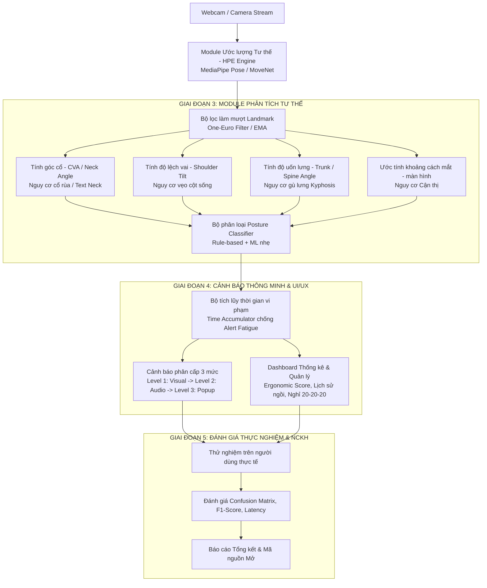

# KẾ HOẠCH PHÁT TRIỂN TIẾP THEO (NEXT STEPS & ROADMAP)
## Đề tài: Hệ thống Giám sát Tư thế Ngồi & Cảnh báo Sớm Nguy cơ Gù Lưng, Cận Thị (SpineVision EdgeAI)

---

## 1. Tổng quan Trạng thái Hiện tại (Current State)

Sau khi hoàn thành **Phase 2 (Pipeline & Benchmark)** theo báo cáo [report.md](file:///media/linhcbs/DATA/NCKH/NCKH%20H%C3%88/code/benchmarks/benchmark_results/report.md):
- ✅ Đã xây dựng pipeline webcam thời gian thực và đo lường định lượng trên phần cứng AMD Ryzen 5 5500U (CPU-only).
- ✅ Đã benchmark 5 mô hình: MediaPipe Pose Lite/Full, MoveNet Lightning/Thunder, YOLOv8n-pose.
- 🎯 **Lựa chọn mô hình cốt lõi (Core Backbone):** 
  - **MediaPipe Pose (Lite / Full)** được chọn làm mô hình chính vì cung cấp đầy đủ **33 landmarks 3D** ($x, y, z$), đặc biệt là các điểm mắt, tai, mũi, vai, hông và tọa độ chiều sâu tương đối $z$, đạt 30–44 FPS trên CPU.
  - Kiến trúc hệ thống sẽ duy trì tính **Modular (Plug-and-Play)** để có thể hoán đổi sang MoveNet Lightning (tối đa FPS) hoặc YOLO-Pose (khi giám sát phòng học/đa người).

---

## 2. Bản đồ Tiến trình (System Architecture & Next Phases)

---

## 3. Kế hoạch Chi tiết Từng Giai đoạn (Detailed Action Plan)

### GIAI ĐOẠN 3: Phát triển Mô-đun Phân tích Tư thế & Đo lường Chỉ số Sinh trắc (Tuần 1–2)

> **Mục tiêu:** Chuyển đổi tọa độ thô $(x, y, z)$ từ các điểm mốc (keypoints) thành các chỉ số công thái học (ergonomics) chuẩn y khoa và phân loại chính xác các lỗi ngồi.

#### 📌 Nhiệm vụ cụ thể:
1. **Lọc nhiễu & Làm mượt chuỗi tọa độ (Temporal Landmark Smoothing):**
   - Áp dụng bộ lọc **One-Euro Filter** hoặc **Exponential Moving Average (EMA)** để loại bỏ hiện tượng rung giật (jittering) giữa các frame liên tiếp của webcam.
2. **Xây dựng giải thuật tính toán 4 chỉ số sinh trắc học cốt lõi:**
   - **Góc gập đầu/cổ (Craniovertebral Angle - CVA / Neck Flexion):** Đo góc tạo bởi đường nối Tai - Điểm giữa 2 vai so với phương ngang. Phát hiện hội chứng *Cổ rùa (Forward Head Posture)*.
   - **Độ lệch vai (Shoulder Tilt Angle):** Đo góc lệch của đoạn nối vai trái - vai phải so với phương nằm ngang. Phát hiện *Ngồi lệch một bên / Nguy cơ vẹo cột sống*.
   - **Góc uốn thân/cột sống (Trunk Angle / Slump):** Đo góc giữa trục cột sống (nối điểm giữa hai vai và điểm giữa hai hông) so với phương thẳng đứng. Phát hiện *Gù lưng / Ngồi sụp (Slouching)*.
   - **Ước tính khoảng cách từ mắt đến màn hình (Eye-to-Screen Distance Estimation):**
     - Phương pháp 1: Tận dụng tỷ lệ khoảng cách giữa hai mắt (Interpupillary Distance - IPD in pixels) kết hợp mô hình quang học camera.
     - Phương pháp 2: Kết hợp tọa độ trục $z$ của điểm mắt/mũi từ MediaPipe Pose.
     - Ngưỡng cảnh báo cận thị: $< 35\text{ cm}$ (hoặc $< 50\text{ cm}$ theo khoảng cách chuẩn màn hình máy tính).
3. **Cơ chế Hiệu chuẩn Cá nhân hóa (Auto-Calibration Mode):**
   - Cho phép người dùng ngồi đúng chuẩn trong 3–5 giây đầu khi bật app để ghi nhận vóc dáng, chiều cao camera và khoảng cách tham chiếu gốc (Baseline).
4. **Xây dựng Bộ phân loại Tư thế (Posture Classifier):**
   - **Tầng 1 (Rule-based):** Sử dụng các ngưỡng góc theo chuẩn công thái học (Ergonomics guidelines).
   - **Tầng 2 (ML Classifier):** Huấn luyện mô hình nhẹ (SVM / Random Forest / KNN) dựa trên vector đặc trưng hình học để nhận diện 5 trạng thái: `Chuẩn (Good)`, `Cúi gập cổ (Forward Head)`, `Gù lưng (Slouched)`, `Nghiêng vai (Shoulder Tilted)`, `Ngồi quá gần (Too Close)`.

---

### GIAI ĐOẠN 4: Phát triển Mô-đun Cảnh báo Thông minh & Giao diện Dashboard (Tuần 3–4)

> **Mục tiêu:** Xây dựng hệ thống cảnh báo thích ứng chống hiện tượng "Mệt mỏi vì cảnh báo" (*Alert Fatigue*) và giao diện trực quan cho người dùng.

#### 📌 Nhiệm vụ cụ thể:
1. **Cơ chế Cảnh báo Thích ứng theo Ngữ cảnh (Context-Aware Alert Engine):**
   - **Bộ đếm tích lũy thời gian (Time Accumulator):** Chỉ kích hoạt cảnh báo khi người dùng duy trì tư thế sai liên tục quá thời gian ngưỡng $T_{bad}$ (ví dụ: $5 - 10\text{ giây}$). Tránh báo động giả khi người dùng chỉ cúi xuống nhặt đồ hoặc cử động thoáng qua.
   - **Cảnh báo phân cấp 3 mức độ (3-Tier Alert System):**
     - *Mức 1 (Nhẹ nhàng):* Đổi màu HUD trên video / Icon khay hệ thống (System Tray).
     - *Mức 2 (Nhắc nhở):* Âm thanh thông báo nhẹ hoặc Pop-up Toast góc màn hình.
     - *Mức 3 (Cảnh báo nghiêm trọng):* Hiệu ứng mờ màn hình hoặc pop-up bắt buộc căn chỉnh lại nếu ngồi sai $> 30\text{ giây}$.
   - **Tích hợp Quy tắc 20-20-20 & Break Timer:**
     - Tự động nhắc nhở thư giãn mắt 20 giây sau mỗi 20 phút làm việc.
     - Nhắc nhở đứng dậy vận động sau mỗi 45–60 phút ngồi liên tục.
   - **Chế độ Focus Mode (Tập trung):** Tạm tắt cảnh báo âm thanh khi người dùng đang họp hoặc thuyết trình.
2. **Thiết kế Giao diện Người dùng (User Interface & Dashboard):**
   - Lựa chọn nền tảng giao diện: Desktop GUI trực quan (PyQt6 / CustomTkinter / Web Dashboard nhẹ với FastAPI + Frontend hiện đại).
   - Các màn hình chính:
     - **Live Monitor Screen:** Video stream kèm skeleton, overlay các góc đo và vạch cảnh báo an toàn trực quan.
     - **Ergonomics Analytics Dashboard:** Biểu đồ tròn phân bố tư thế trong ngày, điểm số công thái học (Ergonomic Score / 100), biểu đồ thời gian ngồi liên tục.
     - **Settings Screen:** Điều chỉnh độ nhạy, chọn webcam, cấu hình âm thanh cảnh báo, quản lý Profile hiệu chuẩn.

---

### GIAI ĐOẠN 5: Đánh giá Thực nghiệm & Hoàn thiện Công trình NCKH (Tuần 5–6)

> **Mục tiêu:** Kiểm định khoa học, thu thập dữ liệu thử nghiệm thực tế và hoàn thiện báo cáo NCKH / Đồ án.

#### 📌 Nhiệm vụ cụ thể:
1. **Thu thập tập dữ liệu kiểm thử thực nghiệm (Test Bench & Real-world Dataset):**
   - Thu thập video/dữ liệu thực nghiệm của học sinh, sinh viên với nhiều vóc dáng, trang phục, điều kiện ánh sáng (sáng/tối) và góc đặt webcam (trực diện, chéo góc $15^\circ - 30^\circ$).
2. **Đánh giá định lượng (Quantitative Evaluation):**
   - Tính toán ma trận nhầm lẫn (Confusion Matrix), Precision, Recall, F1-Score cho từng loại tư thế sai.
   - Đo lường độ trễ từ lúc bắt đầu sai tư thế đến khi phát cảnh báo ($< 500\text{ ms}$).
   - Đo lường mức chiếm dụng CPU, RAM, pin khi ứng dụng chạy nền liên tục trong 2–4 giờ.
3. **Hoàn thiện Sản phẩm & Báo cáo:**
   - Hoàn thiện tài liệu kiến trúc, hướng dẫn cài đặt và đóng gói ứng dụng (Executable / Installer).
   - Soạn thảo báo cáo kết quả NCKH, hoàn thiện các bảng phụ lục A, B, C, D theo đúng đề cương.

---

## 4. Lịch trình Thực hiện Đề xuất (Sprint Breakdown)

| Sprint | Thời gian dự kiến | Nội dung trọng tâm | Đầu ra (Deliverables) |
|---|---|---|---|
| **Sprint 1** | Tuần 1 | Xây dựng module trích xuất chỉ số hình học & Ước tính khoảng cách mắt | Module `posture_metrics.py`, `distance_estimator.py` |
| **Sprint 2** | Tuần 2 | Bộ lọc làm mượt One-Euro & Bộ phân loại tư thế đa tầng (Rule + ML) | Module `posture_classifier.py`, `filter_utils.py` |
| **Sprint 3** | Tuần 3 | Xây dựng Động cơ Cảnh báo thông minh chống Alert Fatigue & Logic 20-20-20 | Module `alert_engine.py`, `session_manager.py` |
| **Sprint 4** | Tuần 4 | Thiết kế Dashboard UI/UX trực quan & Tích hợp hoàn chỉnh hệ thống | Ứng dụng hoàn chỉnh `SpineVision-App` |
| **Sprint 5** | Tuần 5–6 | Thử nghiệm thực tế, thu thập số liệu, viết báo cáo tổng kết NCKH | Báo cáo NCKH hoàn chỉnh, Source code & Video demo |

---

## 5. Bước Hành động Ngay Tiếp Theo (Immediate Next Action)

Để bắt đầu ngay **Sprint 1 (Giai đoạn 3)**, chúng ta sẽ tiến hành:
1. Tạo module **`posture_analyzer/`** chứa các class tính toán góc (CVA, Shoulder Tilt, Trunk Flexion) và hàm ước tính khoảng cách mắt.
2. Tích hợp trực tiếp vào module **MediaPipe Pose** hiện có để hiển thị các chỉ số công thái học trực tiếp lên HUD webcam.
